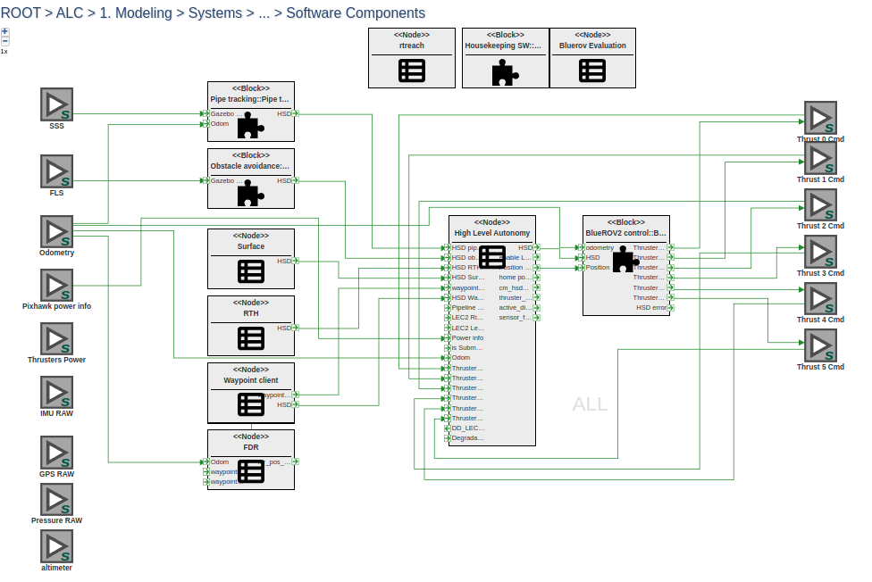

BlueROV2 Activity Definition
===========================

BlueROVSim Activity
-------------------

- To create  a new instance of the BlueROVSim activity, open a BlueROVActivity  model and switch to ALC/Construction/ and click on Testing or DataCollection model.

- Then Drag and drop the "Activity" model from the Part Browser on the left.

- Inside the "Activity" model, launch the "ActivityInit" plugin  (Sometimes this plugin throws an error with a red-box message. Please ignore this and re-run this plugin.)

- Once this plugin is running, in the initial dialog box choose the "bluerov_sim" activity.

- In the subsequent dialog box, choose one or more options that can be configured as part of the BlueROV simulation. Options include 
  
   - Waypoint: Setting up random waypoint generation.

   - Pipeline: Setting up pipeline generation for tracking pipeline.

   - Obstacle:  Static and dynamic obstacle generation during simulation.

   - Degradation: Configuring the thruster degradation and FDIR

   - AIS: This is for setting up the AIS simulation. This feature will be supported in the next release which will include a planner as part of the BlueROV autonomy stack.

   - NoGoZone: Configure the no-go zone.

- Once the options are choosen and submitted, this generates an activity model for simulation.

- The user may change the defaut parameters associated with each of the options above and run the simulation by using the launch activity plugin (refer to headless video).

- When the user hovers over a parameter, its description is shown.

- A list of important parameters to tweak for the CP1, CP2, and CP4 scenarios is presented below.

Common parameters across all scenarios
--------------------------------------

- The parameters in "Execution" table are common across all scenarios. The user may 
   tweak the following parameters

    - timeout (simulation execution time)

    - random_val (random seed for simulation)

CP1_00 (Pipe tracking)
----------------------

This is a general scenario involves pipe tracking and obstacle avoidance. The UUV attempts to avoid static and dynamic obstacles while tracking the pipe. The user may tweak the following tables related to CP1

  - Pipe : For pipeline generation details

  - Obstacles: For static and dynamic obstacles. By default only static obstacle generation is enabled.

CP1_01_geofence_rth
-------------------
This simulation presents a pipe tracking scenario with Geofence failsafe and Return To Home (RTH).

When the UUV reaches maximum distance from Home Position (Geofence = 50m), the UUV activates Geofence failsafe and command Return To Home (RTH).
When UUV reaches home position, it emerges to the surface in a helix.

Parameters of interest include:

 - Autonomy/ batt_charge [0.0 to 1.0]
 
 - Autonomy/ geofence_threshold

 - Autonomy/ failsafe_rth_enable [true/false]

 - Obstacles/ enable_obstacles [true/false]

CP1_02_obstacles
----------------
This simulation presents a pipe tracking scenario, with random obstacles.

Parameters of interest include:

 - Autonomy/ batt_charge [0.0 to 1.0]
 
 - Autonomy/ failsafe_rth_enable [true/false]

 - Obstacles/ enable_obstacles [true/false]

CP1_03_batt_low
---------------
This simulation presents a pipe tracking scenario, with low (20%) battery level at the beginning, without Return to Home function. This means UUV is executing the mission as long as it can, before battery gets critically low (15% for this example).

When the battery level reaches critically low threshold, the UUV is commanded to surface. 
The UUV emerges to the surface in a helix. 

Parameters of interest include:

 - Autonomy/ batt_charge [0.0 to 1.0]
 
 - Autonomy/ failsafe_rth_enable [true/false]

 - Obstacles/ enable_obstacles [true/false]

 - Autonomy/failsafe_battery_low_threshold [0.1 to 0.2]

CP2 (Thruster degradation)
-------------------------

This simulation presents a pipe tracking scenario, with thruster degradation with or without static obstacles. By default it is #1 thruster, efficiency drops to 79% at t=50s.

Fault Detection, Isolation, Reallocation (FDIR - DD_LEC) system is active, detects degradation under 1-5 seconds. After detection FDIR reallocates thrusters to balance torque loss and maintain control for pipe tracking mission.

Parameters of interest include:

 - Degradation/ thruster_motor_failure [true/false]
 
 - Degradation/ enable_fault_detection [true/false] (this controls reallocation - detection itself is actice all the time)
 
 - thruster_id [0 to 5] : ID of the degraded thruster

  - thruster_thrust_force_efficiency [0.0 to 1.0]

  - thurster_motor_fail_starting_time [1 to end of simulation]

  - enable_obstacles [true/false]

CP4 (Waypoint Following)
------------------------

CP4 includes scenarios with waypoint following and obstacle avoidance.

CP4_00
------
This simulation presents a waypoint following scenario. Waypoints are defined in the mission file:

 - mission_file [mission_04.yaml]

CP4_01 (obstacle on waypoint)
-----------------------------
This simulation presents a waypoint following scenario, where a static obstacle is detected close to waypoint #3. UUV alters the waypoint - moves it forward towards the next waypoint. When it is closer to a given threshold to the next waypoint, UUV skips the already altered one.

The Mission/ mission_file parameter controls the mission file used in the simulation. This file includes the waypoints for the UUV to reach.

  - enable_obstacles [true/false]

Real-Time Reachability
----------------------
The RTReach node is always running in the BlueROV simulation. It warns the behavior true if the commanded heading leads to an unsafe situation for the uuv (collision with obstacle or nogo zone).  When RTReach reports UNSAFE condition based on the obstacles,  the UUV is commanded to  "emergency stop". Thereafter, the UUV moves straight up to the surface.

  - use_rtreach [true/false]
