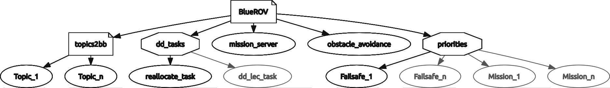
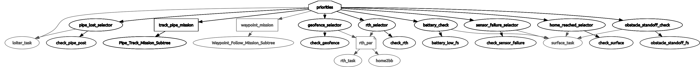
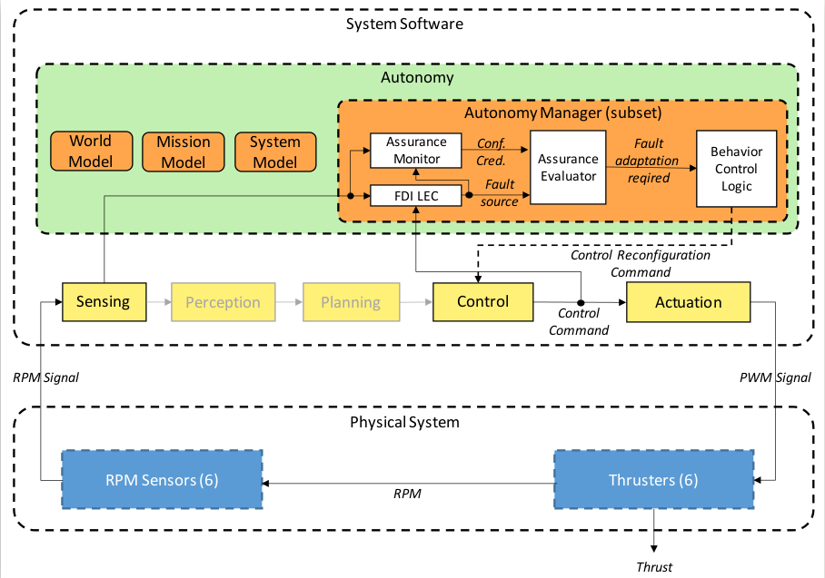

**Behavior Tree** (update rate: `1 Hz`)

This node uses py_trees_ros v0.5.14 package for ROS Kinetic `(https://github.com/splintered-reality/py_trees_ros, http://docs.ros.org/en/kinetic/api/py_trees_ros/html/about.html)`to implement higher level autonomy for the BlueROV2. The package is included in the `bluerov_sim` docker.

The autonomy is using the `bluerov_bt.launch` file with the generated files in `$ALC_HOME/bluerov2_standalone/catkin_ws/src/vandy_bluerov/behaviour_tree_gen/` folder.
For more information about the generator, please check `alc/btree` repo.

In the logs there will be lines starting with `[BT] task_name`.

For detailed information about the BlueROV2 Behaviour Tree based autonomy and the fault detection topic please check: [https://www.mdpi.com/1424-8220/21/18/6089](https://www.mdpi.com/1424-8220/21/18/6089) 

Fig. 1.: General layout of BlueROV BTree

For the autonomy manager check `4.2.1. Autonomy Manager` in the paper. The top level BlueROV root node has parallel children:

- topics2bb: Reads ROS topics, and update the input for the tree
- mission_server: Reads mission file, and controls the mission subtree
- FDIR: Fault detection (Degradation detector LEC + selective classfication AM + thruster control reallocation) subsystem
- Obstacle Avoidance: This node creates the final HSD command for the UUV based on the available HSD commands from mission and obstacle ROS nodes - always active
- Priorities
	- Failsafes: Battery low, RTH, Pipe lost, obstacle standoff, emergency brake, geofence etc.
	- Mission: Pipe Tracking, Waypoint following (FDR also), Loiter subtrees

Fig. 2.: (Simplified) BlueROV BTree

**Mission server:**

In the BTree based mission server, when the simulation is started, the mission file is loaded from `vandy_bluerov/missions`. The parameter is controlled by `mission_file:=` definition in the launch script (launched from IDE) or environment variable (headless mode).
This file can contain one or multiple missions (waypoint following with local, global waypoints or with headings; or pipe tracking)

Standard waypoint mission file is `mission_04.yaml`

Standard pipe tracking mission file is `mission_pipe_track.yaml`

The FDIR system is using the DDLEC to detect thruster degradation and command thruster reallocation.
It contains an LEC-based fault detection and isolation (FDI) module along with an AM. If the LEC with the AM detects a thruster failure and the Assurance Evaluator verifies this fault, then the information is passed to the BT control logic. Under autonomous operation, the FDI subsystem is always running. It receives thruster RPM signals from the sensors and control commands from the Control node. If the LEC and AM are indicating that the AUV is in nominal state, and the Assurance Evaluator confirms this output, there is no need for reconfiguration.

If the LEC detects a degradation (Fault source), the AM calculates the Credibility and Confidence metrics for that output. Using these values, the Assurance Evaluator marks the output as reliable with a Fault Adaptation Required signal, and fault adaptation is initiated. The LEC output class determines the degraded thruster (Actuator) and the approximate degradation level. Based on this information, the Control node can perform a control reallocation using a Thruster Allocation Matrix (TAM) which allows the AUV to continue the mission. 

The degradation detector LEC + selective classification AM runs at `1 Hz` and checks the input data for degradation. The input data are:
*	the 6 thruster commands, 
*	the 6 thruster RPMs (absolute value)
*	heading command (change)

The `enable_fault_detection:=true` parameter controls the fault detection and control reallocation. Note, with the Behaviour Tree based autonomy, the fault detection is always running, only the reallocation part can be turned off with it.

**LECs and AMs in BlueROV**

In this release there are 3 LECs with AMs:

***LEC2Lite with VAE AM:***

 - This is a segmentation LEC for the VU SSS images (pipe perception). 
 - AM is a VAE. LEC and AM were trained on SIM and HW collected data. (HW version is using a ground robot with an RpLidar as the scan source) When log(Martingale) value is high, pipe estimation is disabledIf the mission is pipe mapping, BT commands UUV for minimum speed. 
 - LEC is implemented in TF2.6.2 Lite, can run on CUDA GPU, CPU or Google Coral accelerator.
 - Sources: catkin_ws/src/lec2lite/

***LEC3Lite***
 
 - This is a signal processing NN. Input is the 252 bin sensor raw data (digitalized analog signal from sonar, with multiple contact echos)
 - The lec3_lite_node.py will return with an array of contacts in [m]
 - tflite inference takes around 2ms in average on x64 CPU (i7-9900)
 - Trained with SIM and HW data (MaxSonar MB7070 using Analog Envelope output + RPi Pico)
 - LEC is implemented in TF2.6.2 Lite, can run on CUDA GPU, CPU or Google Coral accelerator.
 - Sources: catkin_ws/src/lec3lite/

***FDIR***

 - Degradation Detection LEC is a fault detector combined with Selective Classification AM. More details can be found in the MDPI paper linked above.