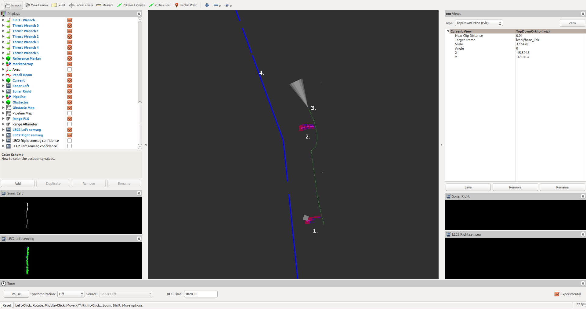
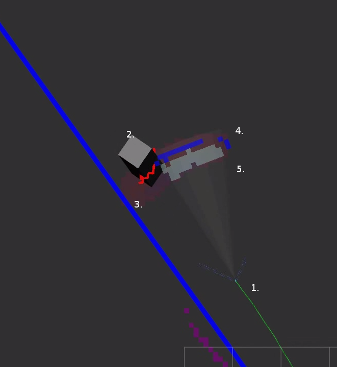
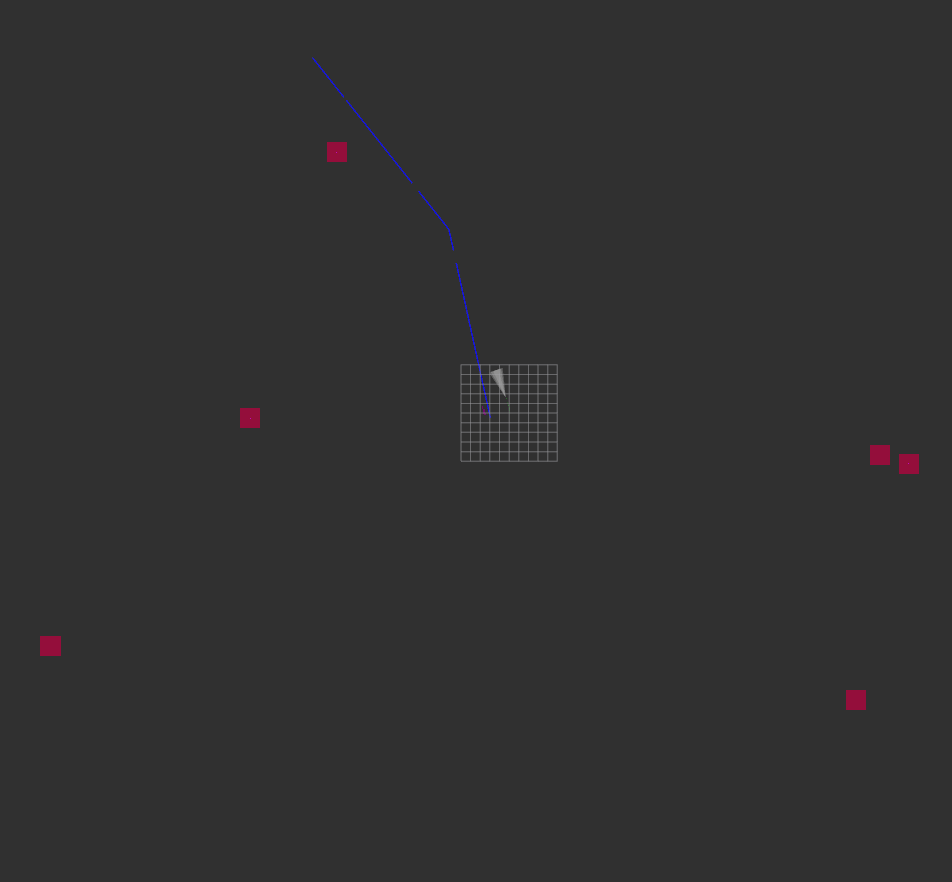
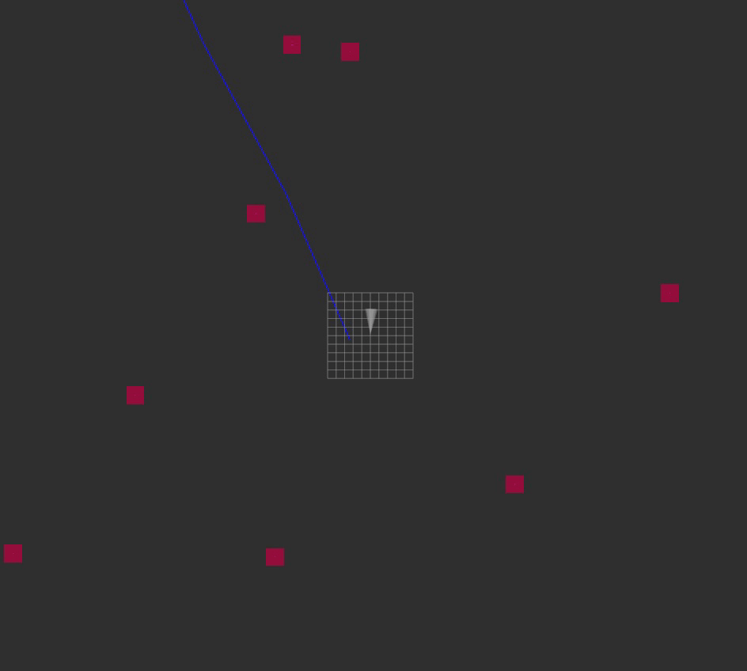

**Obstacle mapping** (update rate: `1 Hz`)

Inputs:

* BlueROV wide angle ultrasonic sonar (single gazebo distance reading)
* VU FLS based LEC3Lite perception 
	* simulated multi-range FLS with 252 bins
	* constructed from 9 narrow beam ultrasonic gazebo sensor 
	* LEC3Lite input: bins, output: array of ranges + bindary classification bins
	* waterfall image representation available in RViZ as a human 'readable' form - for both RAW FLS and LEC3Lite output)

Outputs:
* obstacle world map
* obstacle local map

* /uuv0/fls_echosunder

Update rate: `1Hz`. Map is fixed to World in TF tree

**Static obstacles:**

Processing of FLS messages:

The FLS echosounder (acoustic rangefinder) on the BlueROV2 has a 30 deg beamwidth with 30m range. The sensor gives only a range, so in the given distance the whole beamwidth is mapped as an obstacle. The surrounding 2m radius is represented as danger value. Valid ranges are between 0.5 to 30m. Other readings are neglected (as noise).

If the FLS detects no obstacles ahead, the previously detected obstacle values are decreased in every reading (until it disappear from map or appear again as obstacle).

Fig. 1.: Pipe map in RVIZ
1. Large obstacle with obstacle representation on map
2. Small obstacle with obstacle representation on map
3. UUV and FLS beam
4. Pipeline

**Local obstacle map**

Local map is a small size obstacle map, represents the change in the large map.
Size is `60x60` for BlueROV sonar (size depends on the FLS range).
Local map is fixed to UUV in TF tree

Fig. 2.: Local obstacle map in RVIZ
1. UUV
2. Obstacle
3. Transparent blob: World oriented obstacle map (for avoidance)
4. Local obstacle map: Blue - added value
5. Local obstacle map: Grey - removed value

**Static obstacles:**

Static obstacles always spawned directly ahead of UUV in a fixed distance.
Can be turned on/off with `enable_obstacles=True/False` parameter.
If `enable_debris` also `True`, the static obstacles will be generated on the seafloor (multiple at once, representing debris for SSS)

**Dynamic obstacles:**

Dynamic obstacles will spawned on a perpendicular path ahead of the UUV, in the FLS range (~25m), moving with a constant speed and heading.
Can be turned on/off with `enable_dynamic_obstacles=True/False` parameter.

Picked up static and dynamic obstacles are represented also in a local map (60x60 occupancy grid for BlueROV, 100x100 occupancy grid for LEC3 FLS). Local map is represented in a local UUV's coordinate system. 

**AIS obstacles:**

The information about surface traffic is provided by AIS, while the UUV is at the surface. AIS provides ship position, heading and speed etc. These objects are represented as 'dynamic obstacles'. At initialization, the node generates a list of a given number (`dynamic_obstacles_count`) obstacles with random position, heading and speed around the UUV (`1km`^2^ area). The objects are `20x20m` in size in the obstacle map. The positions are updated `1 Hz`.

Fig. 3.: AIS obstacles on obstacle map in RVIZ

Fig. 4.: AIS obstacles GIF on obstacle map in RVIZ
 

**Map based obstacle avoidance** (update rate: `1 Hz`)

The input is the desired heading from the active mission task (eg. pipe tracking). If there is an obstacle ahead, or in the pipe heading direction, the UUV avoids them using the FLS + obstacle map output. After the obstacle cleared, mission task drives back UUV to the desired path.

Avoidance algorithm:
* If there is no obstacle ahead the UUV (no obstacle in FLS view):
	* if there is no obstacle in the desired heading:
		* Output is mission HSD
	* else:
		* Select the first safe heading using obstacle map. Angle steps are provided by `avoidance_angle_step`value, default: 20 deg.	
* else:
	* Select the first safe heading. Angle steps are provided by `avoidance_angle_step`value, default: 20 deg.	

Note: UUV always avoids the obstacle on the far side of the pipe to avoid crossing over the pipe.

Fig. 1.: Obstacle avoidance and obstacle map in RVIZ
1. Large obstacle with obstacle map representation
2. Small obstacle with obstacle map representation
3. UUV and FLS beam
4. Pipeline

