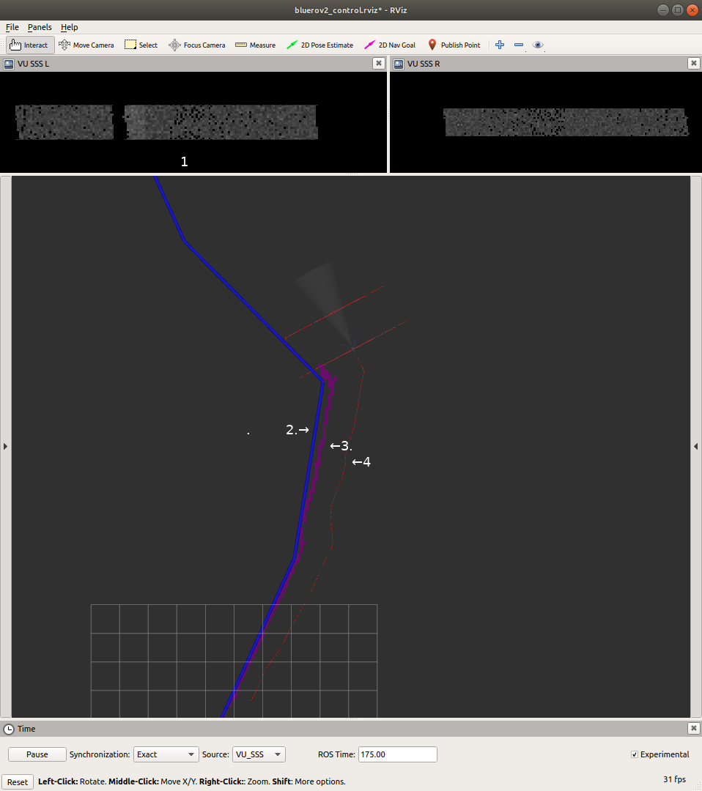

**Pipe mapping** (update rate: `1 Hz`)

Pipe mapping function is always running, if LEC2Lite segmentation output is available - even in waypoint follow missions. (User can combine waypoint follow with pipe track missions in the mission file definition)

Map is a `1000x1000` array (Occupancy map). Resolution is `1m`, value `0` represents empty space, `50` is pipe. Update rate: `1Hz`. Map is fixed to World in TF tree.

Processing of Semseg messages:

Mapping description:

If there is a valid reading from perception LEC2Lite (`cm_use_lec2` enabled and message is not older than `1.5` sec:

* calculate pipe planar distance from UUV based on SSS beam angle parameters and UUV altitude from seabed
* calculate rotation matrix for pipe position using UUV position and rotation
* mark pipe estimated positon on Pipe map
* add pipe estimated position to `pipe_data` (max. `50` estimation) list
* estimate pipe heading using `pipe_data` with 1st order polynomial fitting. *Note: Last pipe heading information is available even when no pipe detected on LEC*
* publish output

**Map based pipe tracking** (update rate: `1 Hz`)

Tracking description:

If the mission type is set to "pipe tracking" this node will produce HSD commands for the BlueROV2 to follow the infrastucture, reconstructed using pipe mapping.

From `pose_gt_noisy_ned` reads UUV heading, from `pipeline_heading_from_mapping` reads the last pipe heading

Update rate `1Hz`: 
* Get UUV and pipe heading difference as desired heading. *Note: Since this method is using pipe heading output from Mapping, so this works even when no Pipe is detected in LEC2 Semseg*
* Slight modification of heading cmd (when UUV and pipe heading close to parallel: differece < 5 deg.) to bring pipe back to center of scan.  The `K_p_pipe_in_sls` controls the strenth of this behaviour.

Fig. 1.: Bring pipe to center of scan in RVIZ
1. VU SSS raw output
2. Pipe estimation
3. Pipe
4. UUV Path

