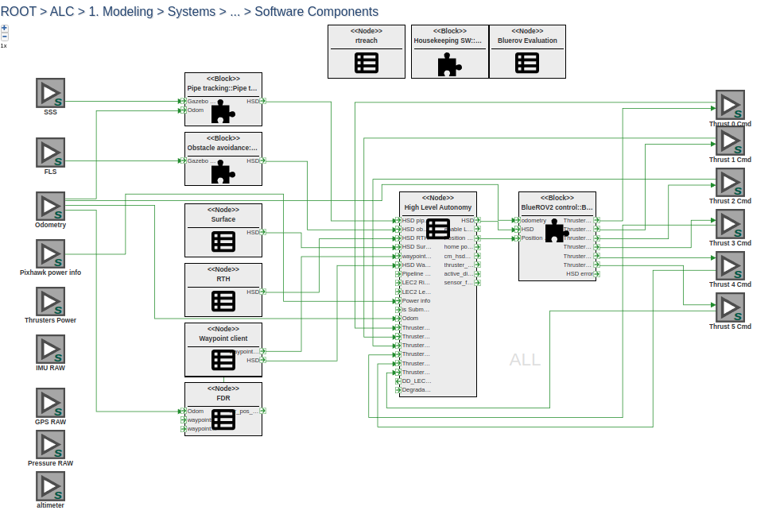

# Readme for BlueROV2

## System Documentation:

* [BlueROV activities](bluerov_activities.md)

## BlueROV software documentation:
* [System overview and Behaviour Tree based Contingency Manager](btree.md)
* [Map based pipe tracking](map_based_pipe_tracking.md)
* [Map based obstacle avoidance](map_based_obstacle_avoidance.md)

Fig. 1.: WebGME model of BlueROV2 software components
