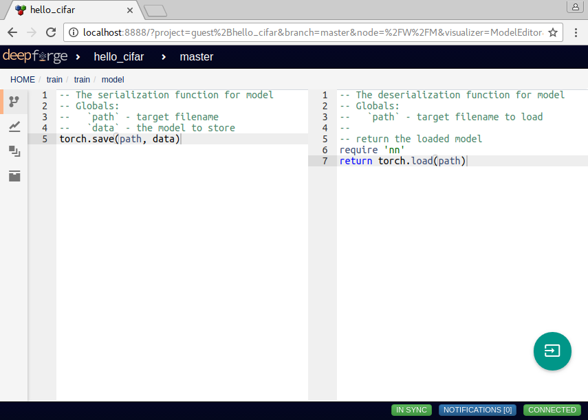

Custom Data Types
=================

As operation inputs and outputs are strongly typed, DeepForge supports the creation of custom data types to promote flexibility when designing complex pipelines and operations. DeepForge data types can be either primitive types or custom classes. Custom DeepForge primitive types are relatively straight-forward; they can inherit from other types and must implement a serialization and deserialization methods (which may be as simple as :code:`torch.save` and :code:`torch.load`). Custom classes are also relatively simple to define but actually contain their own methods along with serialization and deserialization functions.

New data types can be defined from the operation editor from the dialog for selecting input or output data for the operation. After defining a new class, this class is available from within any of the operations in the DeepForge project.

    Editing the serialization and deserialization for the "model" type

