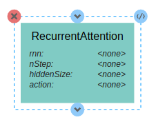
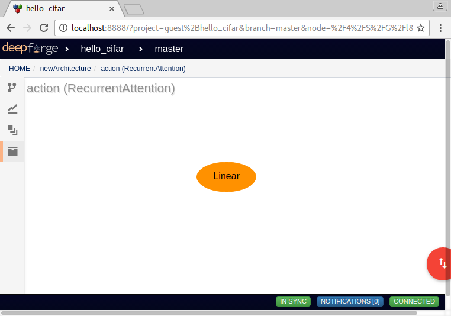

Custom Layers
=============

DeepForge supports the creation of custom neural network layers using Torch7 and the easy usage of these layers in the visual architecture editor. Before creating custom layers, it is recommended to read about `creating custom layers in Torch7 <http://torch.ch/docs/developer-docs.html>`_.

A new custom layer can be created from the "add layer dialog" in the architecture editor. When creating a layer, DeepForge provides a code editor for creating custom neural network layers prepopulated with a basic template for defining the custom layer.

After defining the layer in the layer editor, DeepForge will provide this layer in the architecture editor and expose any configurable attributes for the layer. These attributes are parsed from the layer definition.

Best Practices
--------------
Here are a couple best practices to keep in mind when defining custom neural network layers:

-  Use type assertions for layer, boolean attributes

-  Return :code:`self` when defining setter functions

**Type assertions** should be used when defining layer attributes (ie, constructor arguments or arguments to a setter function). For example, consider the following layer definition for :code:`RecurrentAttention` which accepts an :code:`action` layer argument to its constructor.

.. code-block:: lua

    local RecurrentAttention, parent = torch.class("nn.RecurrentAttention", "nn.AbstractSequencer")

    function RecurrentAttention:__init(rnn, action, nStep, hiddenSize)
       parent.__init(self)
       assert(torch.isTypeOf(action, 'nn.Module'))
       assert(torch.type(nStep) == 'number')
       assert(torch.type(hiddenSize) == 'table')
       assert(torch.type(hiddenSize[1]) == 'number', "Does not support table hidden layers" )
       
       self.rnn = rnn
       -- we can decorate the module with a Recursor to make it AbstractRecurrent
       self.rnn = (not torch.isTypeOf(rnn, 'nn.AbstractRecurrent')) and nn.Recursor(rnn) or rnn
       
       -- samples an x,y actions for each example
       self.action =  (not torch.isTypeOf(action, 'nn.AbstractRecurrent')) and nn.Recursor(action) or action 
       self.hiddenSize = hiddenSize
       self.nStep = nStep
       
       self.modules = {self.rnn, self.action}
       
       self.output = {} -- rnn output
       self.actions = {} -- action output
       
       self.forwardActions = false
       
       self.gradHidden = {}
    end

In this example, :code:`assert(torch.isTypeOf(action, 'nn.Module'))` enforces that the :code:`action` variable is another neural network layer. After defining the layer, DeepForge will parse the layer definition and create a visual representation for use in the architecture editor. As this assertion enforces that :code:`action` is a neural network layer, DeepForge will update itself accordingly; in this case, editing the attribute will allow the user to hierarchically create nested neural network architectures to be passed as the :code:`action` argument to the constructor.

    RecurrentAttention has attributes for each of the constructor arguments

An example of the generated visual model for the :code:`RecurrentAttention` is provided above. This layer has attributes for each of the constructor arguments defined in its definition. Clicking on the :code:`<none>` value for the :code:`action` attribute will then allow the user to provide layer inputs as shown below.

    Creating layer inputs for the "action" variable

The second best practice is to make sure to **return self in any setter functions**. An example of this can be found in the setters in the :code:`SpatialMaxPooling` layer shown below:

.. code-block:: lua

    function SpatialMaxPooling:ceil()
      self.ceil_mode = true
      return self
    end

    function SpatialMaxPooling:floor()
      self.ceil_mode = false
      return self
    end

Returning :code:`self` in setter functions is a good convention when defining neural network layers in Torch7 as it promotes simple and legible code such as

.. code-block:: lua

    net:add(nn.SpatialMaxPooling(5, 5, 2, 2):ceil())

where :code:`net` is a container like a :code:`Sequential` layer. DeepForge enforces this convention and, if it finds a setter function (which also returns :code:`self`) in the layer definition will expose the internal variable (in this case :code:`ceil_mode`) to the user in the visual editor.

