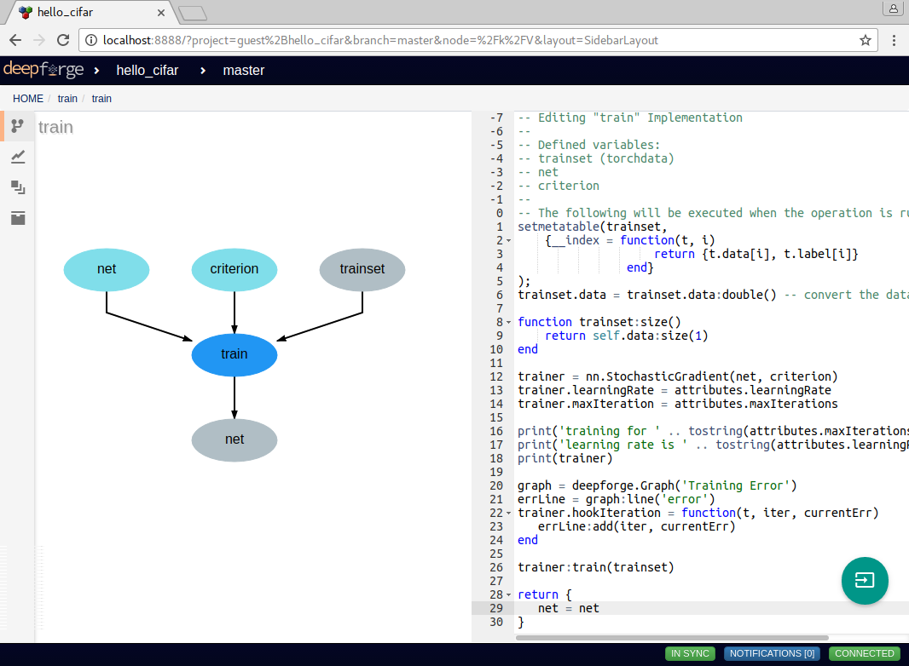
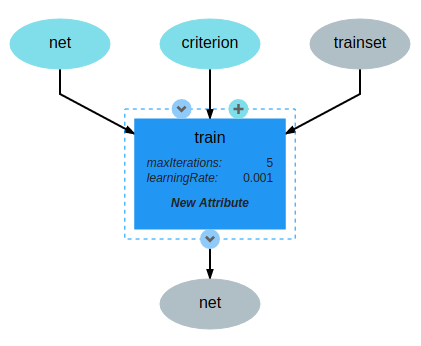
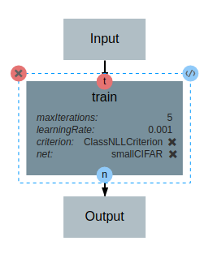
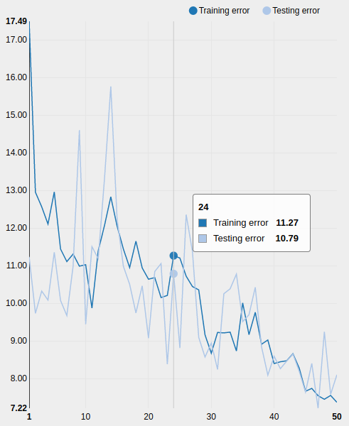

Custom Operations
=================

In this document we will outline the basics of custom operations including the operation editor and operation feedback utilities.

The Basics
----------
Operations are used in pipelines and have named, typed inputs and outputs. When creating a pipeline, if you don't currently find an operation for the given task, you can easily create your own by selecting the `New Operation...` operation from the add operation dialog. This will create a new operation definition and open it in the operation editor. The operation editor has two main parts, the interface editor and the implementation editor.

    Editing the "train" operation provided in the "First Steps" section

The interface editor is provided on the left and presents the interface as a diagram showing the input data and output data as objects flowing into or out of the given operation. Selecting the operation node in the operation interface editor will expand the node and allow the user to add or edit attributes for the given operation. These attributes are exposed when using this operation in a pipeline and can be set at design time - that is, these are set when creating the given pipeline. The interface diagram may also contain light blue nodes flowing into the operation. These nodes represent "references" that the operation accepts as input before running. When using the operation, references will appear alongside the attributes but will allow the user to select from a list of all possible targets when clicked.

    The train operation accepts training data, an architecture and criterion and returns a trained model

On the right of the operation editor is the implementation editor. The implementation editor is a code editor specially tailored for programming the implementations of operations in DeepForge. This includes some autocomplete support for common globals in this context like the :code:`deepforge` and :code:`torch` globals. It also is synchronized with the interface editor and will provide input to the interface editor about unused variables, etc. These errors will present themselves as error or warning highlights on the data in the interface editor. A section of the implementation is shown below:

.. code:: lua

	trainer = nn.StochasticGradient(net, criterion)
	trainer.learningRate = attributes.learningRate
	trainer.maxIteration = attributes.maxIterations

	print('training for ' .. tostring(attributes.maxIterations) .. ' iterations (max)')
	print('learning rate is ' .. tostring(attributes.learningRate))
	print(trainer)

	-- Adding the error graph
	graph = deepforge.Graph('Training Error') -- creating graph feedback
	errLine = graph:line('error')
	trainer.hookIteration = function(t, iter, currentErr)
	   errLine:add(iter, currentErr) -- reporting the current error (will update in real time in DeepForge)
	end

	trainer:train(trainset)

	return {
	   net = net
	}

The "train" operation uses the :code:`StochasticGradient` functionality from the :code:`nn` package to perform stochastic gradient descent. This operation sets all the parameters using values provided to the operation as either attributes or references. In the implementation, attributes are provided by the :code:`attributes` variable and provides access to the user defined attributes from within the implementation. References are treated similarly to operation inputs and are defined in variables of the same name. This can be seen with the :code:`net` and :code:`criterion` variables in the first line. Finally, operations return a table of their named outputs; in this example, it returns a single output named :code:`net`, that is, the trained neural network.

After defining the interface and implementation, we can now use the "train" operation in our pipelines! An example is shown below.

    Using the custom "train" operation in a pipeline

Operation feedback
------------------
Operations in DeepForge can generate metadata about its execution. This metadata is generated during the execution and provided back to the user in real-time. An example of this includes providing real-time plotting feedback of the loss function of a model while training. When implementing an operation in DeepForge, this metadata can be created using the :code:`deepforge` global.

    An example graph of the loss function while training a neural network

Detailed information about the available operation metadata types can be found in the `reference <reference/feedback_mechanisms.rst>`_.
