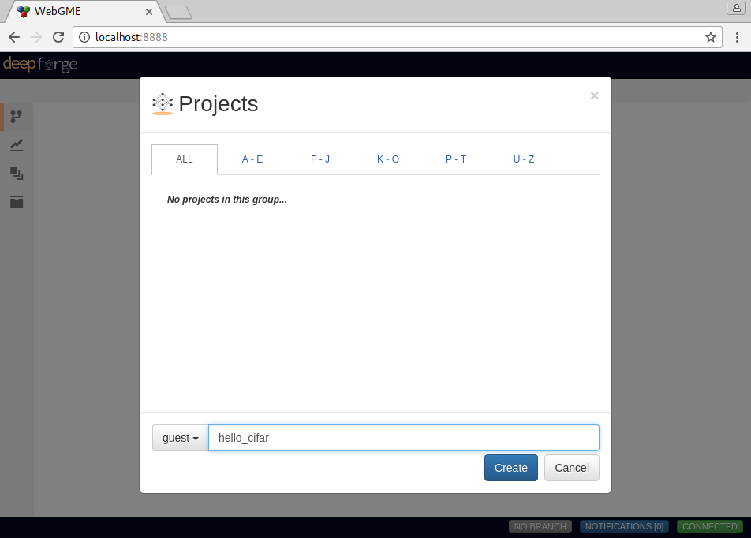
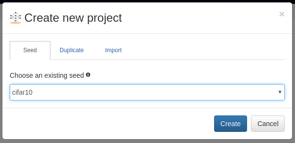
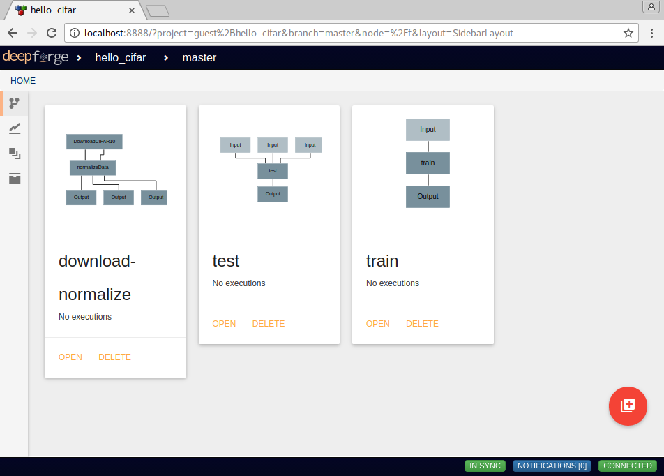
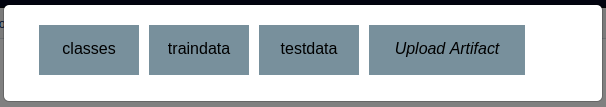
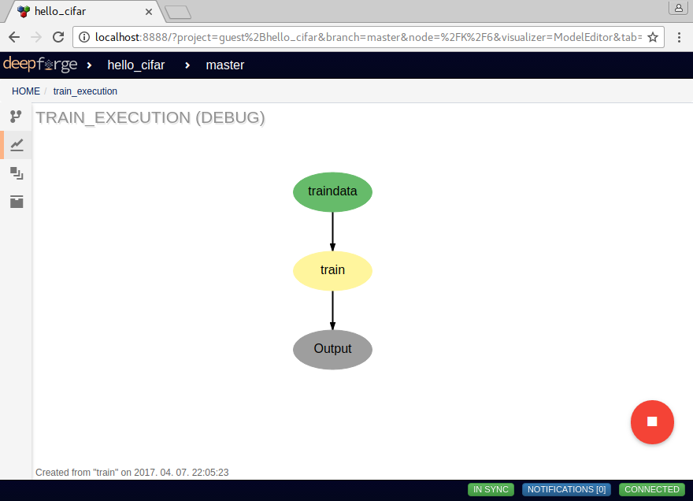
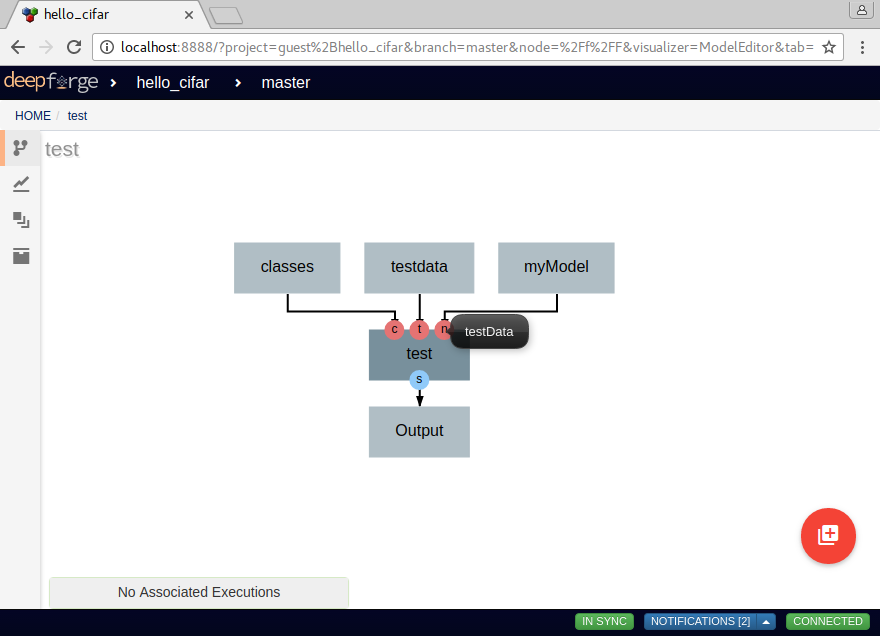
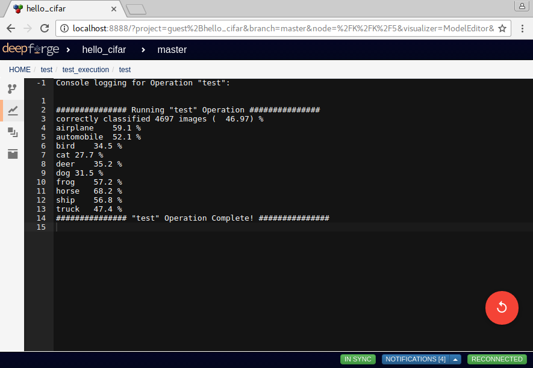

First Steps
===========
DeepForge provides an example project for creating a classifier using the `CIFAR10 <https://www.kaggle.com/c/cifar-10>`_ dataset.

When first opening DeepForge in your browser (at `http://localhost:8888` if following the instructions from the `quick start <getting_started/installation.rst>`_), you will be prompted with a list of projects to open and provided the option to create a new project. For this example, let's click "Create new..." and name our project "hello_cifar".

    Creating our "hello_cifar" example project

Clicking "Create" will bring us to a prompt for the "seed" for our project. Select "cifar10" from the dropdown and click "Create". This will now create our new project based on the cifar10 example provided with DeepForge.

    Selecting the "cifar10" example seed

In this example, we have three main pipelines: :code:`download-normalize`, :code:`train` and :code:`test`. :code:`download-normalize` downloads and prepares our data. The :code:`train` pipeline trains a neural network model on the cifar10 dataset and the :code:`test` pipeline tests our trained model on our test set from the cifar10 dataset.

    Three main pipelines in the cifar10 example project

First, we will have to retrieve and prepare the data by running the :code:`download-normalize` pipeline. This can be done by opening the given pipeline then selecting the `Execute Pipeline` option from the action button in the lower right. As soon as that pipeline finishes, we can now use this data to train a neural network.

Next, we can open the :code:`train` pipeline. Before we execute the pipeline we have to set the input training data that we will be using. This is done by selecting the :code:`Input` operation then clicking the value for the :code:`artifact` field. This will provide all the possible options for the input data; for this example, we will want to select the "trainingdata" artifact. After setting the input, we can click on the :code:`train` operation to inspect the hyperparameters we are using and the architecture we are training. Selecting the :code:`Output` operation will allow you to change the name of the resulting artifact of this operation (in this case, a trained model). Finally, we can execute this pipeline like before to train the model.

    Selecting the training data for the input to the training pipeline

As this operation trains, we can view the status by viewing the running execution. The easiest way to view the running execution is by clicking the given execution from the execution tray in the bottom left when viewing the originating pipeline.

    Viewing the execution of the training pipeline

Once the model has been trained, we can test the given model using the :code:`test` pipeline. In this pipeline, we have a few more inputs to set: "testing data", "model to test" and the "human-readable class labels". If you aren't clear which operation provides which input, you can simply hover over it's connected port on the :code:`test` operation. This will provide a tooltip with the full name of the input.

    Viewing the execution of the testing pipeline

After setting the inputs for the :code:`test` pipeline (using the trained model and data from the first two pipelines), we can simply execute this pipeline to test our model. After executing the :code:`test` pipeline, we can view the execution and open the :code:`test` job to view the stdout for the given job. In the :code:`test` operation, this will allow us to view the printed accuracies of the model over each class.

    Viewing the results of the testing operation

And that's it! We have just trained and tested our first neural network model using DeepForge. Although there are still a lot more advanced features that can be used, this should at least familiarize us with some of the core concepts in DeepForge.
